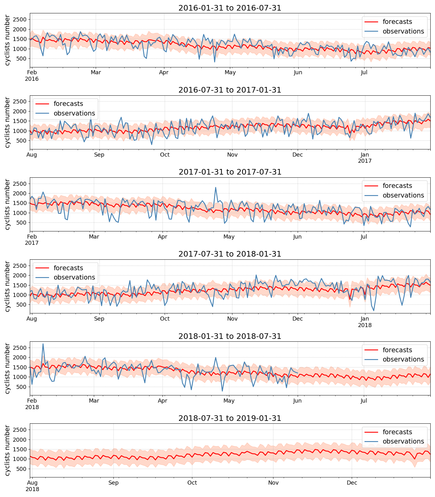
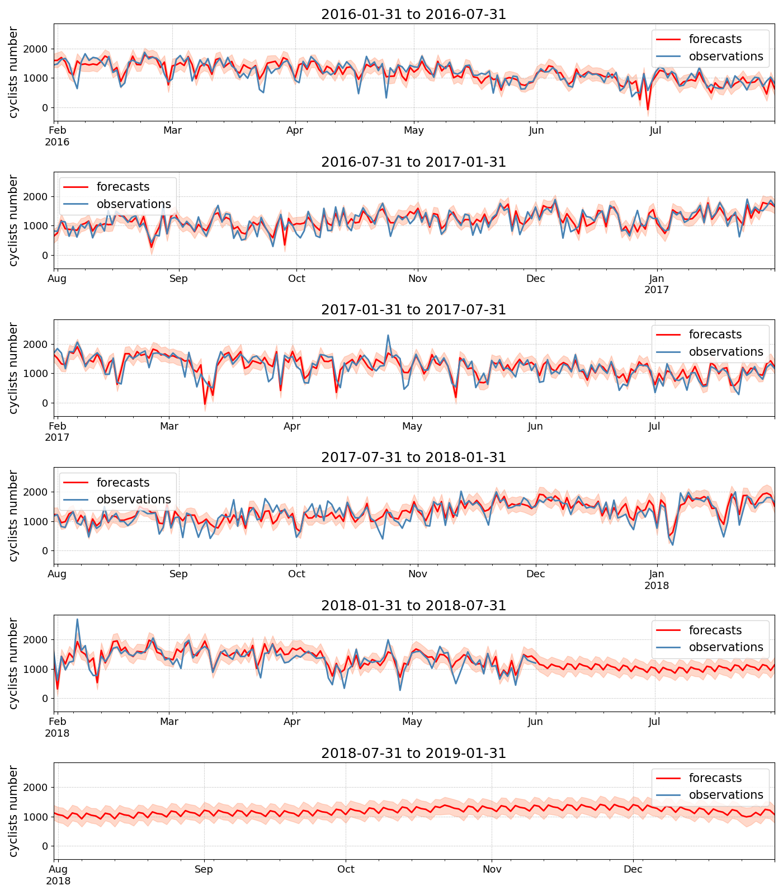

# ds3.6

simple repository for data science on ubuntu:python3.6

# for sample prediction

## simple execution all tasks

```bash
make all
```

### preparation of sample data

you can download `Auckland Cycling` dataset

```bash
make data
```

### run the sample program with `fbprophet`

you can run via `make` command the sample prgram which predicts by using fbprophet
(around 20 minutes)

```bash
make
```

or 

```bash
make run
```

### check results

you can view the images of predicted images


- prediction result with no exogenous data

    ```bash
    display app/img/forecasted_simple_linear.png
    ```

    


- prediction result with exogenous data

    ```bash
    display app/img/forecasted_exog_linear.png
    ```

    

## debug the program

you can debug with pudb3

```bash
make debug
```

# for Development Environment

## Available for VSCode
you can use on VSCode like `Open Folder in Container`

## Available docker-compose independently

### build

```bash
docker-compose build --no-cache
```

### up

```bash
docker-compose up
```

### down

```bash
docker-compose down
```

## Available Makefile for task controls

### up

```bash
make up
```

### down

```bash
make down
```

### reup

up again after down

```bash
make reup
```

### clean

```bash
make clean
```
